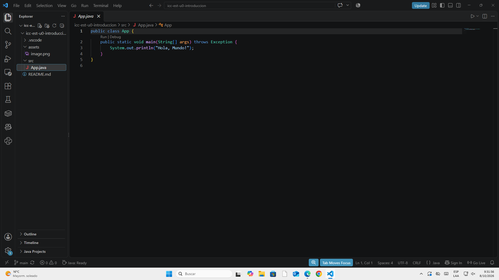

# Estructura de datos

Nombre:
Martín Villacrés

## Practica 1
Fecha 06 De octubre

Hoy creé el proyecto de java totalmente funcional.

## Practica 2
Fecha 08 de octubre

Adicioné grafos y se dañó.

